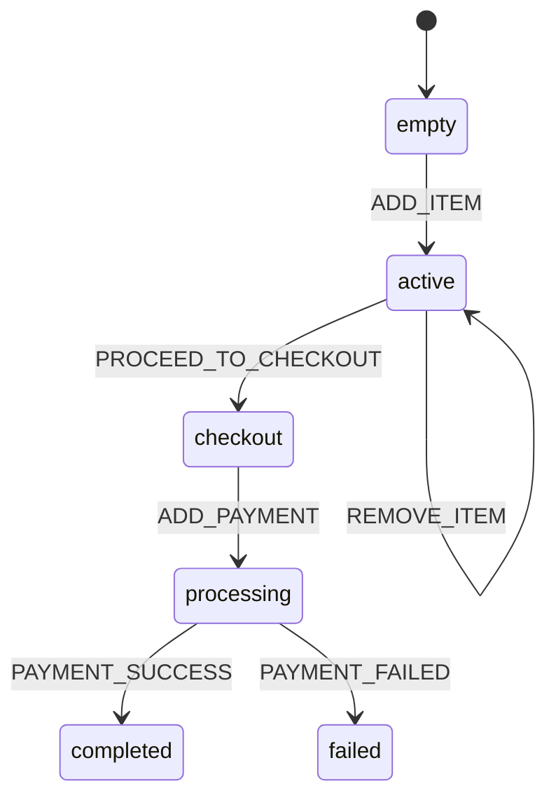

# Shopping Cart Example

This is a comprehensive real-world example demonstrating how `statedoc` generates documentation for a state machine that manages an e-commerce shopping cart workflow.

## Overview

The shopping cart state machine (`cart.machine.ts`) models a typical e-commerce checkout flow:

1. **Empty Cart**: Starting state with no items
2. **Active Cart**: Cart contains items, customer can shop or checkout
3. **Checkout Flow**: 
   - Shipping information collection
   - Payment information collection
4. **Order Processing**: Validating and processing the order
5. **Completion States**: Success or failure outcomes

## Before: Raw State Machine Code

The state machine is defined in TypeScript using XState-compatible syntax. While developers can read the code, it's not easily accessible for:
- Product managers planning features
- QA teams designing test scenarios  
- Documentation teams writing user guides
- Stakeholders understanding business logic

See the raw state machine in [`cart.machine.ts`](./cart.machine.ts).

## After: Generated Documentation

Run `statedoc` to automatically generate human-readable documentation:

```bash
cd examples/shopping-cart
statedoc gen
```

### Generated Files

The tool creates:

1. **`docs/index.md`** - Overview of all state machines
2. **`docs/machines/shopping-cart/README.md`** - Machine details with states list
3. **`docs/machines/shopping-cart/states/*.md`** - Individual state documentation
4. **`docs/machines/shopping-cart/diagram.mmd`** - Mermaid state diagram

### Example Generated Content

#### Machine Overview (`docs/machines/shopping-cart/README.md`)

```markdown
## shoppingCart
Shopping Cart State Machine

States:
- [empty](./states/empty.md) — Cart is empty, awaiting first item
- [active](./states/active.md) — Cart has items
- [checkout](./states/checkout.md) — Customer in checkout process
- [processing](./states/processing.md) — Order being processed
- [completed](./states/completed.md) — Order successfully completed
- [failed](./states/failed.md) — Order processing failed
```

#### State Detail (`docs/machines/shopping-cart/states/active.md`)

```markdown
# shoppingCart / active
Cart has items, customer can continue shopping or checkout

Transitions:
- ADD_ITEM → active
- REMOVE_ITEM → active  
- UPDATE_QUANTITY → active
- PROCEED_TO_CHECKOUT → checkout
- CLEAR_CART → empty
```

#### Mermaid Diagram (`docs/machines/shopping-cart/diagram.mmd`)



## CLI Output Example

When you run the generator:

```bash
$ statedoc gen --config=.stateDoc.json

📝 state-docs v1.0.0
📂 Source: .
📄 Config: .stateDoc.json
🎯 Target: ./docs

Parsing state machines...
  ✓ Found 1 machine(s)

Generating documentation...
  ✓ Created docs/index.md
  ✓ Created docs/machines/shopping-cart/README.md
  ✓ Created 6 state pages
  ✓ Created docs/machines/shopping-cart/diagram.mmd

✨ Documentation generated successfully!
```

## Integration Testing

This example includes a test that validates:
- Configuration loading
- State machine parsing
- Documentation generation
- File structure creation

Run the integration test:

```bash
# From repository root
deno task test:example
```

## Use Cases

This shopping cart example demonstrates state-docs value for:

### 1. **Product Teams**
- Understand complete checkout flow at a glance
- Identify edge cases and error states
- Plan new features based on current state structure

### 2. **QA Teams**  
- Generate test scenarios from state transitions
- Ensure all paths are covered
- Validate error handling flows

### 3. **Documentation Teams**
- Auto-generate user flow documentation
- Keep docs in sync with code
- Reduce manual documentation burden

### 4. **Developers**
- Onboard new team members faster
- Review state machine logic during code review
- Maintain consistency across implementations

## Customization

The example uses default templates. You can customize by:

1. **Custom Templates**: Override `machineIndex` and `statePage` templates in `.stateDoc.json`
2. **Styling**: Add CSS to generated Markdown for branded documentation
3. **Automation**: Integrate into CI/CD to auto-update docs on every commit

## Next Steps

1. Explore the generated documentation in the `docs/` folder
2. Modify `cart.machine.ts` and regenerate to see updates
3. Try customizing templates in `.stateDoc.json`
4. Integrate into your own project following this pattern
